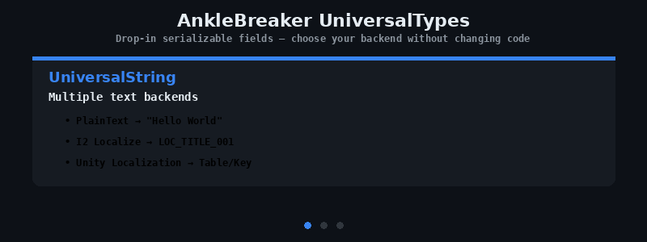

<p align="center">
  
</p>

# AnkleBreaker Utils UniversalTypes — Universal Wrapper Types for Unity

> **Drop-in serializable fields that let users choose between multiple backends without changing code.** UniversalString (I2L + Unity Localization), UniversalAsset (Direct + Addressables), UniversalSound (AudioClip + Wwise + FMOD). UPM-ready, zero required dependencies. Free and open source by [AnkleBreaker Studio](https://github.com/AnkleBreaker-Studio).

[](https://github.com/sponsors/AnkleBreaker-Studio)
[](https://assetstore.unity.com/publishers/101837)

## Types

### UniversalString

A string field that supports multiple text sources:

- **PlainText** — Raw string value
- **I2Localize** — `I2.Loc.LocalizedString` (resolved via I2L natively)
- **Unity Localization** — `UnityEngine.Localization.LocalizedString` (resolved via Unity Localization package)

Priority when both localization packages are present: **I2L > Unity Localization > PlainText**.

```csharp
[SerializeField] private UniversalString title;

// Implicit conversion to string (resolves localization automatically)
string text = title;

// Or explicit ToString()
Debug.Log(title.ToString());

// Create from code
UniversalString plain = "Hello World";
UniversalString fromCode = new UniversalString("Some text");
```

### UniversalAsset\<T\>

A generic asset reference with two modes:

- **Direct** — Standard Unity object reference
- **Addressable** — `AssetReference` for `Addressables.LoadAssetAsync<T>()`

```csharp
[SerializeField] private UniversalSprite icon; // alias for UniversalAsset<Sprite>

// Direct mode
Sprite sprite = icon.DirectReference;

// Addressable mode
var handle = Addressables.LoadAssetAsync<Sprite>(icon.AddressableReference);
```

### UniversalSound

A sound reference supporting multiple audio middleware:

- **AudioClip** — Standard Unity AudioClip
- **Wwise** — `AK.Wwise.Event`
- **FMOD** — `FMODUnity.EventReference`

```csharp
[SerializeField] private UniversalSound clickSound;

switch (clickSound.Mode)
{
    case UniversalSound.SoundMode.AudioClip:
        audioSource.PlayOneShot(clickSound.AudioClip);
        break;
#if AB_WWISE
    case UniversalSound.SoundMode.Wwise:
        clickSound.WwiseEvent.Post(gameObject);
        break;
#endif
#if AB_FMOD
    case UniversalSound.SoundMode.FMOD:
        RuntimeManager.PlayOneShot(clickSound.FMODEvent);
        break;
#endif
}
```

## Installation

Add via Unity Package Manager using the Git URL:

```
https://github.com/AnkleBreaker-Studio/AnkleBreaker-Utils-UniversalTypes.git#Release
```

## I2 Localization Setup

If you use **I2 Localization** (Asset Store version without asmdef), the package will detect it automatically on first import and offer to create the required Assembly Definitions (`I2.Loc.asmdef` + `I2.Loc.Editor.asmdef`).

You can also trigger this manually via: **AnkleBreaker > UniversalTypes > Create I2L Assembly Definitions**

## Requirements

- Unity 2022.3 LTS or later
- No required dependencies — works standalone
- Optional: I2 Localization, Unity Localization, Addressables, Wwise, FMOD

## Scripting Defines (auto-detected)

| Define | Source |
|---|---|
| `AB_I2_LOCALIZE` | I2 Localization detected (via DefineManager) |
| `AB_UNITY_LOCALIZATION` | `com.unity.localization` installed (via versionDefines) |
| `AB_ADDRESSABLES` | `com.unity.addressables` installed (via versionDefines) |
| `AB_WWISE` | Wwise SDK detected (via DefineManager) |
| `AB_FMOD` | FMOD SDK detected (via DefineManager) |

## Part of the AnkleBreaker Ecosystem

| Package | Description |
|---------|-------------|
| [AnkleBreaker-Core](https://github.com/AnkleBreaker-Studio/AnkleBreaker-Core) | Base classes, interfaces, delegates |
| [Utils-Inspector](https://github.com/AnkleBreaker-Studio/AnkleBreaker-Utils-Inspector) | 40+ custom inspector attributes (free Odin alternative) |
| [Utils-Extensions](https://github.com/AnkleBreaker-Studio/AnkleBreaker-Utils-Extensions) | 50+ C# extension methods for Unity |
| **Utils-UniversalTypes** (this) | Universal wrappers for localization, assets, audio |
| [Unity MCP](https://github.com/AnkleBreaker-Studio/unity-mcp-server) | 268 AI tools for Unity Editor control |

## License

See [LICENSE.md](LICENSE.md)
